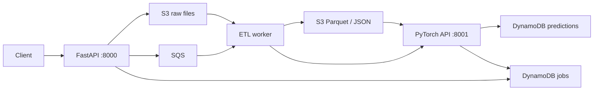

# AI-Powered Cloud Data Pipeline

A runnable local demonstration of file ingestion, asynchronous ETL, PyTorch inference, and AWS-style storage using FastAPI, S3, SQS, DynamoDB, and LocalStack.

**Model scope:** the neural networks use seeded, untrained demo weights. Their risk/sentiment labels and confidence scores demonstrate plumbing, not accurate predictions. No trained checkpoints or labeled training data are supplied. This is a local development project, not an authenticated production service.



## Run locally

Requires Docker Engine with Compose and access to its daemon.

```bash
docker compose up --build -d --wait
# Both service docs become available once startup completes:
# http://localhost:8000/docs
# http://localhost:8001/docs
python -m venv .venv
source .venv/bin/activate
pip install requests
python scripts/demo_pipeline.py
```

The demo uploads both supplied CSV and text files, waits for results, prints predictions, and exits with an error on failure or timeout. Use `--base-url` and `--timeout` to change its defaults. Stop containers with `docker compose down`. LocalStack storage is ephemeral.

### Docker socket permission denied

If Docker reports `permission denied` for `/var/run/docker.sock`, containers have not started. Activating the Python environment does not change Docker access. Run from the project directory:

```bash
sudo docker compose up --build -d --wait && .venv/bin/python scripts/demo_pipeline.py
```

Enter your Linux password in your terminal when sudo prompts. The `&&` runs the demo only after successful startup; `--wait` waits for API health checks. Use `sudo docker compose logs --tail=100` if startup fails. Python itself does not need sudo.

## Upload workflows

Direct uploads accept multipart `file` and `data_type` (`structured` or `unstructured`):

```bash
curl -F file=@data/samples/sample_structured.csv -F data_type=structured http://localhost:8000/api/v1/upload
curl http://localhost:8000/api/v1/jobs/JOB_ID
```

For a presigned upload:

1. `POST /api/v1/presigned-url` with `{"filename":"data.csv","data_type":"structured","content_type":"text/csv"}`.
2. PUT the file bytes to the returned `upload_url`, using the same Content-Type.
3. `POST /api/v1/jobs/{job_id}/complete-upload` to verify the object and queue processing.
4. Poll `GET /api/v1/jobs/{job_id}` for `INFERENCE_COMPLETED` or `FAILED`.

Presigned jobs begin as `PENDING`. Completion before uploading returns 409; repeated completion after successful scheduling returns the current job. Compose signs URLs using `http://localhost:4566`, accessible to clients on the Docker host. Set `S3_PUBLIC_ENDPOINT_URL` if clients use another address. The Compose workflow explicitly publishes SQS messages; it does not rely on S3 notification configuration.

## Data and inference contract

- Structured: CSV, JSON records, or Parquet. Headers are normalized; collisions are rejected. Numeric nulls and infinities are filled with the column median (zero if entirely missing), and missing categories become `unknown`.
- Structured inference requires exactly four numeric columns, in source order. Additional text columns are retained by ETL but excluded from inference. No feature scaling is performed.
- Unstructured: UTF-8 `.txt` files. Whitespace is normalized and text is split at sentence punctuation into chunks.
- Direct uploads have a configurable 50 MiB limit (`MAX_UPLOAD_BYTES`). Presigned uploads bypass this API limit, but the worker still loads each dataset into memory; size resources accordingly.
- `POST /api/v1/predict/realtime` accepts `{"data_type":"structured","features":[1,2,3,4]}` or `{"data_type":"unstructured","text":"Hello world"}`.
- `POST /api/v1/predict/batch` accepts `job_id`, `s3_key`, `data_type`, and optional `bucket` for an existing processed dataset.
- `GET /health` on each API reports service health. Inference also reports `model_mode: untrained_demo`.

## Reliability and limits

The API registers a job before publishing it to SQS. Workers propagate failures, record the error on the job, and retain failed messages for retry. Local SQS uses a 900-second visibility timeout and moves messages to a dead-letter queue after five receives. A successful redelivery of a completed job is skipped; prediction IDs are stable per job and row. Failed jobs may subsequently complete on retry. Prediction queries follow DynamoDB pagination.

There is no distributed transaction between DynamoDB and SQS and no processing lease for concurrent duplicate deliveries. This demo is intended for a single worker with jobs that finish within the visibility timeout. For production, add an outbox/reconciliation process, concurrency leases and visibility renewal, authentication, resource limits, IAM roles, and trained/versioned models. AWS deployment/IaC is not supplied; Compose provisions only local resources. The Lambda adapter supports direct S3 and SQS events (including S3 notifications wrapped in SQS); enable `ReportBatchItemFailures` for SQS and ensure jobs are registered first. Do not enable both S3 notifications and explicit API queue publication for the same flow.

## Tests

```bash
source .venv/bin/activate
pip install torch --index-url https://download.pytorch.org/whl/cpu
pip install -r requirements.txt
python -m pytest tests -q
```

Tests use Moto and in-process HTTP clients; no running AWS services are required. They cover transformation, model forwards, both ingestion paths, actual worker orchestration, persisted predictions, retries, and invalid input. Run `docker compose config --quiet` to validate container configuration.

Service source lives under `services/ingestion_api`, `services/pipeline_worker`, and `services/ai_inference`. Local resource setup is in `infrastructure/localstack_init`; executable examples are in `scripts` and `data/samples`.
